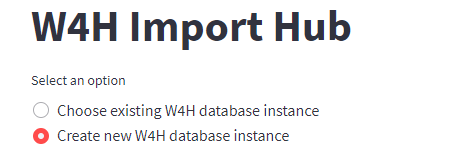
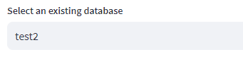
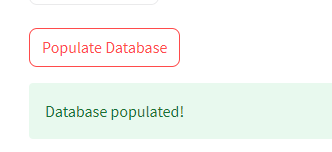
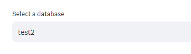
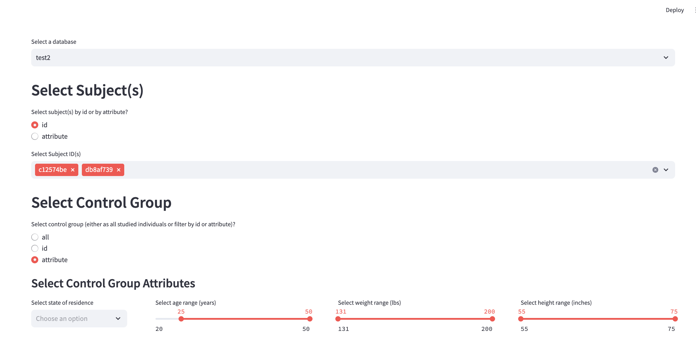

## ICDE Demo

### Demo Scenario

Follow these steps:

1. **Log in**  
    Login with:
    > username: admin  
    > password: admin

2. **Create test2 database**
    Click the "import dataset" button, you will see a page like this:

    

    Create a new database instance by selecting "Create new W4H database instance":

    

    Input the database name and click *create*:

    

    You should see the following:

    

    Select "Choose existing W4H database instance":

    

    Select the database you just created:

    

    Download sample data:

    [synthetic_subject_data.csv](https://github.com/USC-InfoLab/w4h-datasets/blob/main/synthetic_subject_data.csv)  
    [synthetic_timeseries_data.csv](https://github.com/USC-InfoLab/w4h-datasets/blob/main/synthetic_timeseries_data.csv)  

    Check "Populate subject table" and upload `synthetic_subject_data.csv`:

    

    Click "Populate database" at the bottom:

    

    Upload `synthetic_timeseries_data_reduced.csv`:

    

    Click "Populate database":

    

3. **Data analytics on the test2 dataset**  

    Click on the "Analyze Dataset" button and select test2 from the dropdown:

    

    Select the subjects and control group you want to check

    

    Set the analysis configuration

    

    Click "show result" to display the data analytics.

4. **Streaming data analytics on the test2 dataset**  

    Click on the "Input Page" button and select test2 from the dropdown:

    

    Select the subjects and control group you want to check

    

    Set the analysis configuration for streaming data 

    

    Click "show result" to display the data analytics.

See also [DEMO_SCENARIO.md](https://github.com/USC-InfoLab/w4h-icde-demo/blob/main/DEMO_SCENARIO.md)